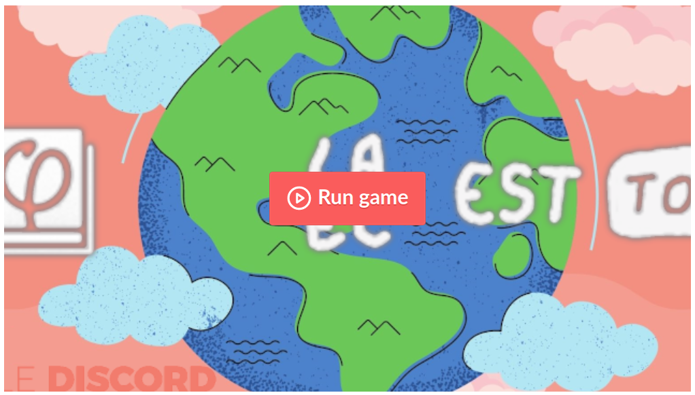

# LAEC EST TOI

`LAEC` = **L**'**A**venir **E**n **C**ommun (https://laec.fr)

Rewrite the very rules of the game.

> `BABA IS YOU` + `L'Avenir En Commun` + `⬡`
> _This game is an homage to BABA IS YOU and is not affiliated with BABA IS YOU in any way._

## BLABLA EST ANGLAIS

> Si vous souhaitez rédiger/lire une version française de ce `README.md`, crééz `README.fr.md`.

## PLAY IS FUN

Play or Download: https://discord-insoumis.itch.io/laec-est-vous

    NUMPAD IS MOVE
    ARROW IS MOVE
    MOUSE IS MOVE
    JOYSTICK IS MOVE
    ENTER IS ENTER
    ESCAPE IS ESCAPE
    SPACE IS PASS
    R IS RESTART
    U IS UNDO

## BRAIN IS DEFEAT

A friendly bee will guide you if you wait once at the beginning of a level.

### BUG IS MORE

> The codebase should be purged with fiendfyre ; spaghetti, crutches, shortcuts, bouerk…

This project is the product of a quick jam from amateurs.  **There will be bugs.**

Some will be hairy.  Some will be icky.  We will try to shield players as best we can.
But, as a level designer, you will see them all.  Brace yourselves!

Report them, fix them, bypass them…   Be creative, and most importantly: _DON'T PANIC_.

### YOU MAKE LEVEL

#### Ingame Editor

Click on `YOU` in the start menu.  Then click `NEW`.

#### Advanced

Click on `YOU MAKE LAEC` in the top dock.
Click on `MAKE NEW LEVEL`.  Save your level somewhere in `levels/`.

##### Old way

Go to `Scene > New inherited scene`, choose `core/Level.tscn`.

In the Inspector, on the right, select a map scene, and set a title and subtitle.

Select the `Items` layer node, right-click on it, and instance a child scene from `core/Item.tscn`.

You can duplicate the Item child scenes, change their concepts,
move them around, and hit REFRESH in the top dock of the 2D Editor.

Save your scene somewhere in `levels/`.

---

You can also make a new map, or submaps.

### YOU MAKE ART

Things are in the directory `sprites/items`.

#### PIT IS FALL

- `NOT THING IS NOT THING`
  → should blow up pretty quick, since it will create many items on each turn

## GOD IS YOU

_You make the game._

1. Download [Godot 3](https://godotengine.org/download/),
2. Download [the source](https://framagit.org/laec-is-you/laec-is-you/-/archive/master/laec-is-you-master.zip) and unzip it somewhere.  Even better, `git clone https://framagit.org/laec-is-you/laec-is-you.git` to be able to publish your changes !
3. Run Godot.
4. Open this project.
5. Follow instructions.
6. Enjoy!

> Remember to request a merge of your additions, so that everyone can enjoy them!

## CONFIG IS OPEN

Godot allows overriding any part of our `project.godot` file, including (but not limited to) the actions shortcuts.

Create an `override.cfg` file with the parts of the `project.godot` you wish to verride, and put it right next to the distributed binary.

Refer to the [Godot documentation](https://docs.godotengine.org/fr/stable/classes/class_projectsettings.html) about this feature.

## CODE IS CLOSE

_Just kidding._  The code is **WTFPL**.
That means you may do _whatever the fork you want_ with it, _except complain_.
The license of the sprite assets is CC0.
Godot Game Engine is MIT.

## SOUND IS STOP TROLL

The sound assets (original soundtrack) are copyrighted by _@precheurius_.
**You may not use tham without permission.**

## PUBLIC HAS LOVE

> [Le Discord Insoumis](http://discord-insoumis.fr/)

- Fanelia (💃🎨) _Enthusiasm_
- Trollune (👽⌨) _Code Design_
- Precheurius (🎶🎹) _Sound Design_
- Adrenesis (🎅🎮) _Editor Design_
- Miidnight (🌿🌈) _Coordination_
- Dazo (🌋🎊) _Game Design_
- Bogoss69 (💀❤) _Silent Support_
- Roipoussiere (😎🌸) _Bit Shifts_
- Karibou (🍇🦄) _Mastermind_
- Zargett (👮🕊) _Level Design_
- SpyBob (🕰🗱) _Pre-Alpha Testing_
- Stheal (✒🕯) _Level Design_
- Niwatori (🎓🧠) _Pixel design_
- Lametyste (💕🎸) _Backgrounds_
- IvanC (📜🔭) _Level Design_
- AudreyH (🦊✏) _Everything_
- Gobz (⚡🏋🏾‍) _Touillage_
- JeanSebastienBachOfficiel (🍏🎻) _Alpha Testing_

Special thanks to our parents and extended families for beta-testing the game and for their unwavering support.

## YOU HAS THANK

Mostly people who unwittingly contributed to the project.

- Baba Is You
- Godot Game Engine Contributors
- Kenney (CC0 assets from https://kenney.nl/)
- La Riot Insoumise

